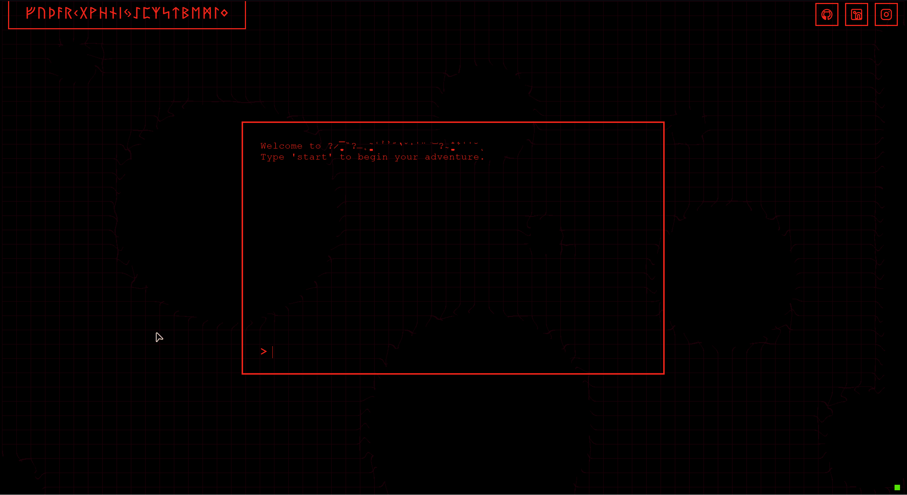
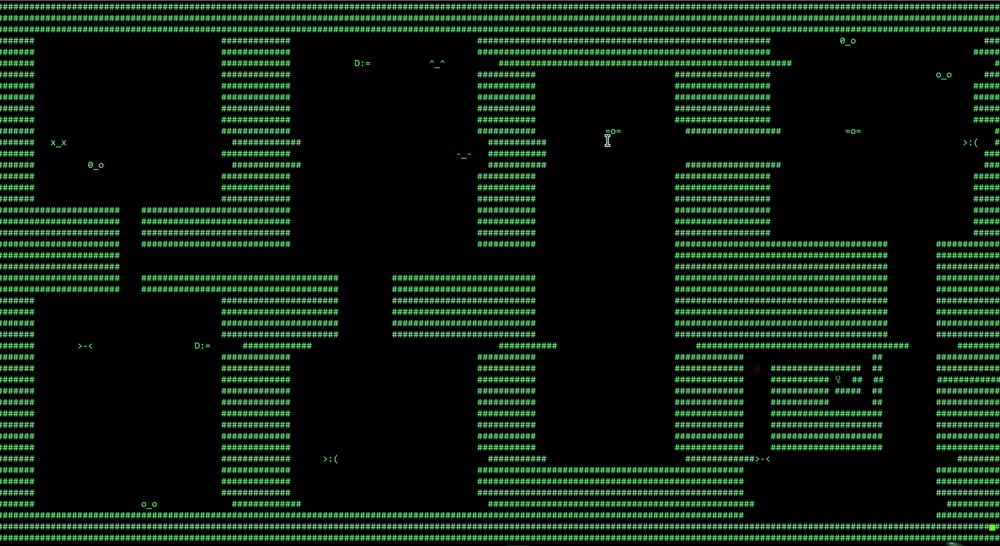
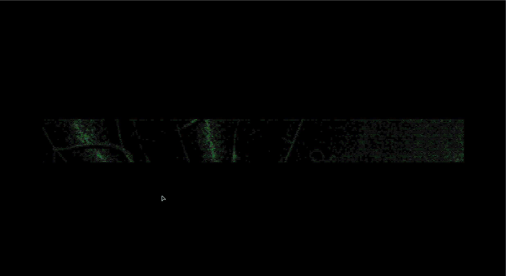

# Nullpoint Game

**Live Site:** [https://alex-gamero.github.io/Nullpoint/](https://alex-gamero.github.io/Nullpoint/) 

## Overview
Nullpoint is an interactive text-based game that features a terminal interface where players can input commands to progress through a captivating story. The game is designed to immerse players in a dark, mysterious world where their choices shape the narrative.

## Getting Started

### 🚀 Prerequisites
- A web browser (Chrome, Firefox, Opera, etc.)
- A PC or Laptop, Nullpoint cannot be opened on a cell phone.

### 🕹️ Running the Game
**Just Click Here:** [https://alex-gamero.github.io/Nullpoint/](https://alex-gamero.github.io/Nullpoint/) 

## 🎮 Gameplay
Players will interact with the game by typing commands into the terminal interface. The game will respond based on the input, leading to various scenarios and endings. Explore different paths and uncover the mysteries of Nullpoint.

## 🆘 Contributing
Contributions are welcome! If you have suggestions or improvements, please open an issue or submit a pull request.

## ❇️ Endings
Under development

